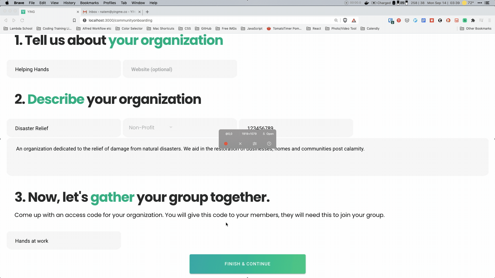

# YING-Internship
## Overview
This is a writeup of experiences and accomplishments during my time at YING.

During this **9 week Internship** I had the pleasure of helping to build up the YING web and mobile application.

YING is a platform being built to allow people to skill share with eachother thus empowering individuals, non-profits and corporations to exchange their resources and skills for time based credits.

    

    
    

## Added Features
### 1. Reset Password Flow
- GIF displaying the flow of a User required to use multifactor authentication by default in order to reset password. This is an entirely new flow that I was able to add to the project in my time with YING.

  

### 2. Shareable Link
- GIF displaying an added feature where a link is programmatcially generated. This link can be shared with other Users/non-Users to route them to the join-a-group  page. The form auto populates and the User will be bale to join with the press of a button. I added this feature and handled all routing and permissions for Users from 3 User states:
    - Logged in --> routes to join said group
    - Logged out --> routes to join said group after logging in
    - Not yet a User --> onboards a User then routes to join said group
      

## Detailed list of tasks performed during my time with YING:
1.  Refactor of App.tsx on the Front-End
    - Identified mishandling of token placement & required token setting to be performed only during login / signup / app-initialization
    - Simplified rerouting logic
    - Limited app rerendering by changing app-initialization logic which prevents a loss of in app memory/state
    - Ensured onboarding a User includes multi-factor authorization
2. Improve Routing and Private-Route component
    - Remove token setting ability
    - Add authentication logic to simplify access permissions to any page without being logged in
    - Corrected in app flow patterns to match design specifications
3. Onboarding a User
    - Refactored forms to reflect current design needs
    - Added custom validation to forms
    - Modified GraphQL call on Front-End and changed Back-End code to return additional data to maintain symmetry between onboarding an organization vs a User
4. Refactored Mail Chimp code (for email marketing purposes)
    - Refactor of code in the Back-End to eliminate 200 lines of code by combining 2 calls to the external API
    - Refactor of code in the Front-End to reduce 150 lines of code by simplifying call functions and thoughtfully replacing the location of code within the onboarding flow
    - Designed a new function to incorporate group tagging for fine grain targeted marketing purposes
5. Implemented a shareable link feature
    - Upon creating an organziation a link is programmatically generated that is able to be read by the application to route the User and prepopulate the form so as to be able to join a group or organization with a simple button press
6. Implemented a multi-factor Reset Password flow
    - Coded several new components to authenticate and match User data using Firebase prior to sending a reset password email
7. General Refactoring
    - Thoughtfully refactored repetetive code to implement DRY software development principles
    - Maintainability improved through implementing functions that reuse pure functional components

## New and Practiced Skills
- Learned to use Ionic
- Learned to work with Prisma Back-End
- Worked with GraphQL both Front-End and Back-End
